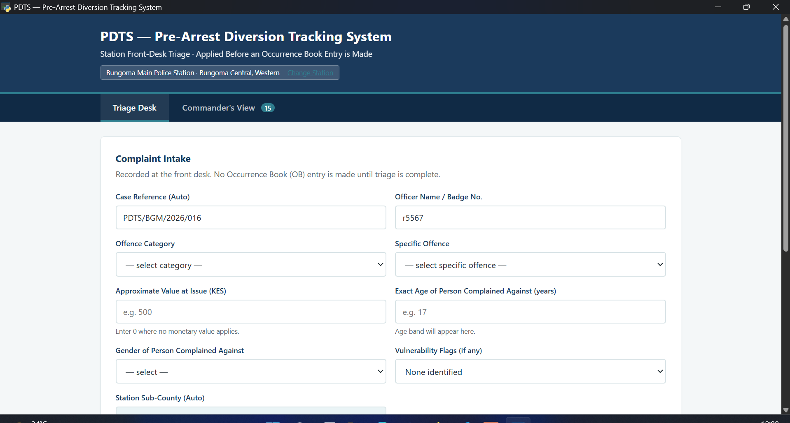
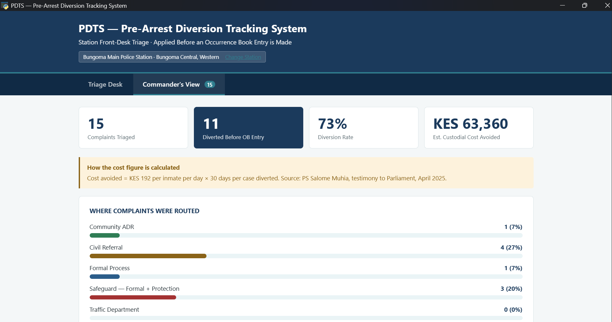
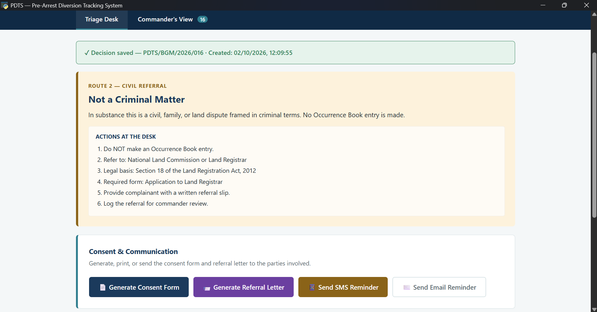

# PDTS — Pre-Arrest Diversion Tracking System

**A front-desk triage tool for Kenyan police stations.** Routes petty, civil, and traffic matters away from the criminal justice system — before an Occurrence Book entry is made.

Kenya remands nearly 55,000 people in facilities built for 34,000. Seventy percent of those cases are petty offences the ODPP has already stated should be diverted. PDTS is the missing front-desk tool that makes the policy work in practice.

---

## The Problem

Kenya's criminal justice system is clogged with cases that should never have entered it.

- **70%** of cases processed through the justice system are petty offences (ODPP Diversion Policy).
- **90%** of incarcerated women in Kenya are mothers (Clean Start Africa, 2026).
- **61.5%** of remandees were married with dependants — every remand destroys a household.
- **161%** overcrowding: 54,750 people in facilities built for 34,000.

Two people I met at Bungoma Main Prison made this real:

- A **17-year-old boy**, remanded for stealing a pair of trousers. The complainant later withdrew the case — but not before he had spent 35 days in an adult facility, despite letters from his chief and headmaster. He lost a month of school and now carries a record for life.
- A **man living with HIV**, brought into remand visibly weak and cut off from his antiretroviral medication. His offence: a minor civil dispute. He nearly died — not because of the offence, but because of the system that saw him as an accused before it saw him as a sick person.

Both were preventable. PDTS exists to prevent the next two.

---

## What PDTS Does

PDTS is a lightweight, offline-first desktop application deployed at the police station front desk. It records every complaint — serious and petty — and **auto-routes each one to the legally correct authority** based on facts captured at intake.

| Route | Condition | Outcome |
|---|---|---|
| **Safeguard Gate** | Sexual offence, GBV, offence against a child, serious violent offence | Formal process + victim protection. No diversion, no consent form. |
| **Child Protection** | Person under 12 years | Children's Officer referral. No arrest, no charge, no OB entry as accused. |
| **Civil Referral** | Child support, land dispute, debt, boundary dispute | Referral letter to the correct office. No OB entry. |
| **Community ADR** | Petty or economic offence, first-time, willing offender, willing complainant, value under statutory cap | Diverted to chief, baraza, or accredited mediator with a 14-day follow-up tracker. No OB entry. |
| **Traffic Department** | Minor traffic offence | Instant fine or Notice to Attend Court under Section 117 of the Traffic Act. |
| **Formal Process** | Offender resisted arrest, repeat offender, unwilling offender, complainant refuses ADR, unlisted offence, value above cap | Occurrence Book entry, formal charge. |

**Disqualifiers override diversion and route to formal process automatically:** resisted arrest, obstructed officer, repeat offender, unwilling offender, complainant refusal (Article 50(9)), value above statutory cap, blocked offence types.

---

## Screenshots

**Triage Desk — intake and outcome**

**Commander's View — live dashboard**

**Generated referral letter**

---

## Legal Framework

PDTS implements existing Kenyan law, not new policy:

- **Article 159(2)(c)** of the Constitution — alternative dispute resolution
- **Article 50(9)** — victim's right to be heard (complainant refusal of ADR)
- **Children Act, 2022** — minors, best interests of the child, no unnecessary remand
- **ODPP Diversion Policy, 2023** — mandatory consideration of diversion for petty offences and vulnerable persons
- **Section 117, Traffic Act** — minor traffic offence handling
- **Mental Health Act, Cap. 248, s.16** — vulnerable persons handling
- **Data Protection Act, 2019** — data minimisation by design

---

## Data Protection by Design

PDTS does not store names. It does not store ID numbers. It does not store phone numbers or email addresses.

The database stores only:

- Case reference (station-specific, e.g., `PDTS/BGM/2026/001`)
- Offence category and detail
- Exact age, gender, vulnerability flag
- Offender behaviour, prior history, willingness
- Complainant willingness
- Sub-county and routing decision

All personal identifiers appear only on the printed physical consent form, which is signed and filed as required by law. If the station computer is stolen, no personal data is compromised.

---

## Tech Stack

- **Backend:** Python, Flask
- **Database:** SQLite (single file, no server)
- **Frontend:** HTML, CSS, JavaScript
- **Desktop wrapper:** PyWebView
- **Packaging:** PyInstaller (single `.exe`)

The system runs on any Windows station computer with no internet connection. Data is stored in `pdts.db` next to the `.exe` and can be exported to CSV at any time.

---

## Installation

Run from source:

    pip install flask flask-cors pywebview
    python launch_pdts.py

Build the standalone `.exe`:

    pip install pyinstaller
    python build_exe.py

The executable is written to `dist/PDTS.exe`. The SQLite database (`pdts.db`) is created next to it on first run.

---

## Roadmap

**Q1 2027 — Ship and publish**
- CSA pilot agreement, one station, three months
- Three public data stories (SGBV by county, remand trends, petty offence economics)

**Q2 2027 — Deepen the stack**
- Deploy hosted version for remote review
- Full technical documentation

**Q3 2027 — Get paid**
- Apply to five funders and consultancies
- Pitch PDTS to three county governments

**Q4 2027 — Scale or join**
- Train officers across two stations
- Publish case study

---

## Author

**Samwel K. Simotwo**
Social Welfare Officer, Bungoma Main Prison
Creator of PDTS

---

## License

MIT — use it, fork it, build on it. Credit required. See [LICENSE](LICENSE).
